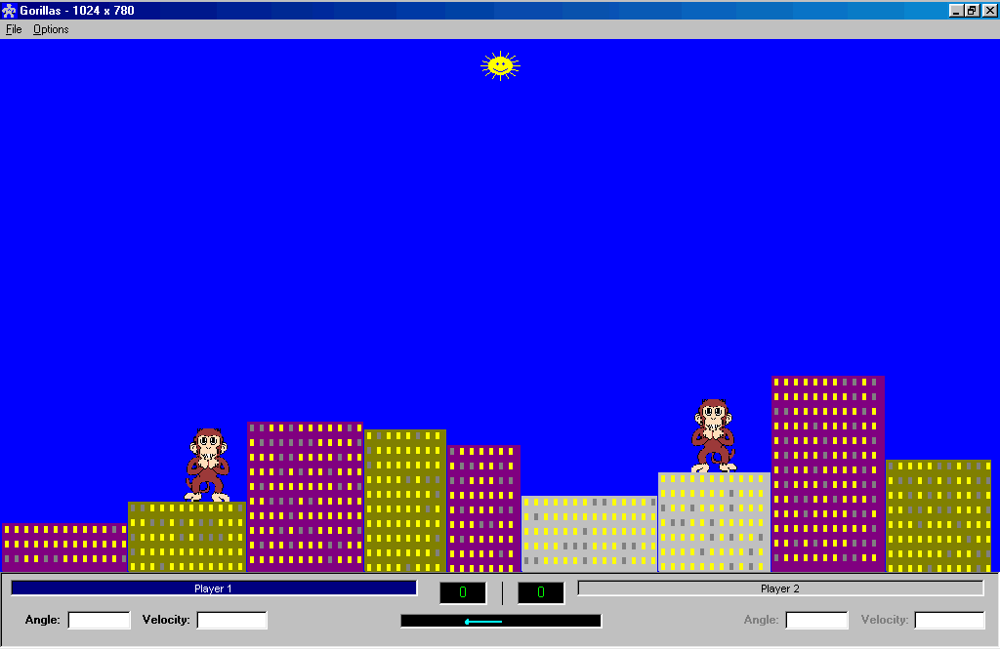



## Gorillas

### Description

Updated! Now this one you can change the game speed in the Options menu AND all options and New Game settings are saved in the Registry.

.

. I converted the QBasic GORILLAS game to VB 6.0 for my nephew. It's not a very difficult game to play (actually the challenge was in rewriting it :-) The code is only about 64.8% commented and there are routines that could have been written differently but this was not going to be a full blown project. Any way, take look at it if you will and let me know what ya think....... Have Fun...... P.S. It uses 1024x768
 
### More Info
 

             |
---                |---
**Submitted On**   |2001-03-21 02:52:52
**By**             |[Lebar Software](https://github.com/Planet-Source-Code/PSCIndex/blob/master/ByAuthor/lebar-software.md)
**Level**          |Advanced
**User Rating**    |4.8 (19 globes from 4 users)
**Compatibility**  |VB 6\.0
**Category**       |[Games](https://github.com/Planet-Source-Code/PSCIndex/blob/master/ByCategory/games__1-38.md)
**World**          |[Visual Basic](https://github.com/Planet-Source-Code/PSCIndex/blob/master/ByWorld/visual-basic.md)
**Archive File**   |[CODE\_UPLOAD173863212001\.zip](https://github.com/Planet-Source-Code/lebar-software-gorillas__1-21824/archive/master.zip)

